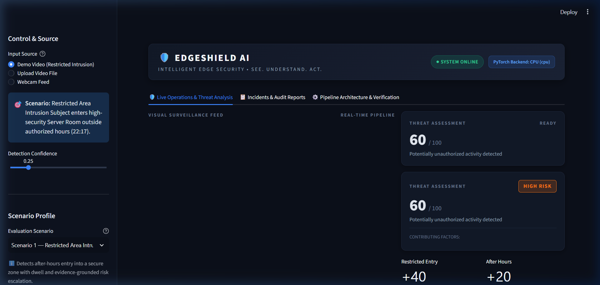
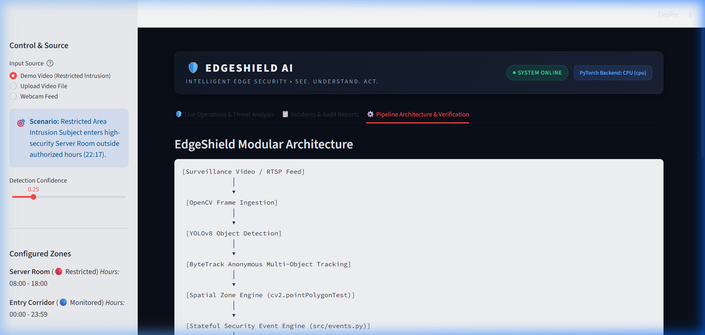
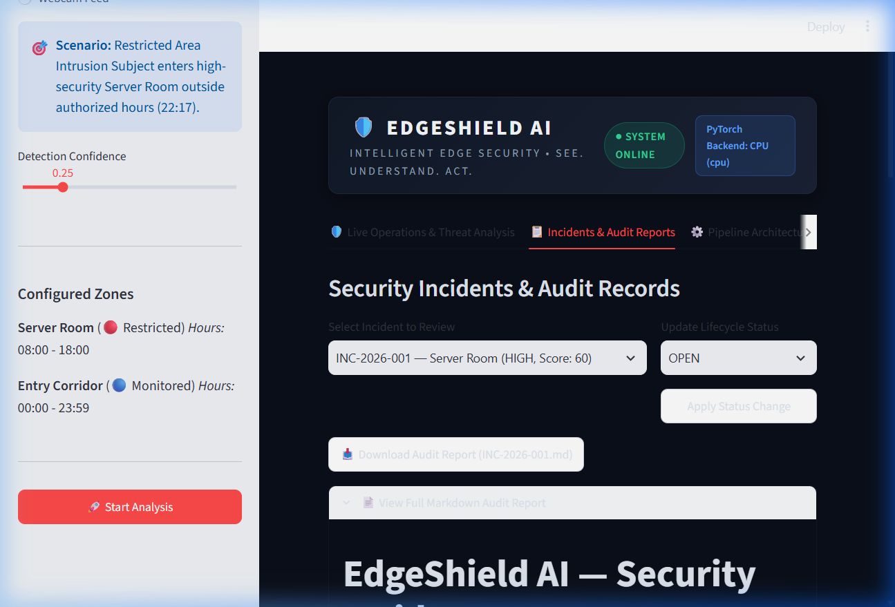

# EdgeShield AI

> **See. Understand. Act.**

EdgeShield AI is an intelligent, privacy-aware edge security analytics platform. It combines edge computer vision, anonymous multi-object tracking, spatial-temporal event generation, deterministic heuristic risk assessment, and evidence-grounded AI reasoning to deliver actionable physical security intelligence in real time.

---

## Overview

Modern physical security systems suffer from alarm fatigue, heavy cloud bandwidth costs, privacy vulnerabilities, and rigid rule engines that fail to provide actionable context. **EdgeShield AI** solves these challenges by evaluating surveillance video directly at the edge, converting raw pixels into chronological structured events, assessing risk deterministically, and using compact large language models (Llama 3.2) to synthesize plain-English incident briefings and operator recommendations—without sending continuous raw video streams to the cloud.

---

## Problem

- **Alert Fatigue & False Positives**: Traditional video analytics flood security operations centers (SOCs) with disjointed motion alerts lacking contextual understanding.
- **Bandwidth & Latency Bottlenecks**: Continuously streaming high-definition surveillance video to the cloud incurs immense network bandwidth and recurring infrastructure costs.
- **Privacy & Compliance Hazards**: Centralized storage of raw footage and biometric facial recognition poses severe GDPR, CCPA, and civil liberties compliance liabilities.
- **Unreliable "Black-Box" Alarms**: End-to-end AI models frequently hallucinate facts or fail silently without deterministic, verifiable audit trails.

---

## Solution

EdgeShield AI enforces a strict multi-stage **Sense → Structure → Score → Reason** architecture:
1. **Sense**: Ingests video streams locally using lightweight object detection (YOLOv8) and anonymous multi-object tracking (ByteTrack).
2. **Structure**: Converts continuous coordinates into discrete, verifiable security events (`zone_approach`, `restricted_zone_entry`, `restricted_zone_dwell`, `after_hours_activity`, `loitering_detected`, `abandoned_object_detected`).
3. **Score**: Calculates a transparent, deterministic baseline risk score (0–100) using audited security heuristics.
4. **Reason**: Employs Llama 3.2 to interpret the structured chronological timeline, explaining *why* the sequence matters and recommending concrete operator actions grounded strictly in observed evidence.

---

## Key Features

- **🛡️ Privacy-Aware Edge Processing**: Pure anonymous tracking (`Person #07`). No facial recognition, biometric profiling, or identity databases. Downstream reasoning operates strictly on structured metadata.
- **📐 Interactive Spatial Zones**: Define polygonal restricted, monitored, or access perimeters with zone-specific operational windows (e.g. 08:00–18:00) using OpenCV vector geometry (`cv2.pointPolygonTest`).
- **⏱️ Stateful Security Event Engine**: Detects approaches, boundary crossings, dwell duration, stationary object interactions, loitering, and unusual movements.
- **⚖️ Deterministic Risk Engine**: Reproducible baseline scoring (0–29 LOW, 30–59 MEDIUM, 60–79 HIGH, 80–100 CRITICAL) guarantees operational reliability even during network or LLM offline states.
- **🧠 Grounded Llama 3.2 Reasoning**: Zero hallucination policy. Directives strictly prohibit inventing unobserved facts or claiming proven criminal intent, using probabilistic security risk language.
- **📋 Lifecycle Incident Management**: Auto-generates formal incident audits (`INC-2026-001`) with timeline tracking, status workflows (`OPEN`, `INVESTIGATING`, `RESOLVED`, `DISMISSED`), and one-click JSON/Markdown audit report exports.
- **⚡ Secondary Security Scenarios**: Five configurable scenario profiles:
  - *Scenario 1*: Restricted Area Intrusion (Primary MVP)
  - *Scenario 2*: Sensitive Area Loitering
  - *Scenario 3*: Abandoned / Unattended Object
  - *Scenario 4*: After-Hours Facility Activity
  - *Scenario 5*: Unusual High-Velocity Movement
- **🖥️ Dark Enterprise Operations Dashboard**: Streamlit SOC interface with real-time video overlays, risk gauges, live chronological timeline, and architecture verification tabs.

---

## Architecture

```text
[Surveillance Camera / RTSP Feed]
              │
              ▼
  [OpenCV Frame Ingestion]
              │
              ▼
  [YOLOv8 Object Detection]  ─── 54.64 ms (Edge Inference)
              │
              ▼
  [ByteTrack Anonymous MOT]  ─── 40.36 ms (Track ID Association)
              │
              ▼
  [Spatial Zone Engine]      ─── cv2.pointPolygonTest
              │
              ▼
  [Security Event Engine]    ─── 0.11 ms (Stateful Event Sequencing)
              │
              ▼
  [Temporal Context Engine]  ─── Chronological Synthesis
              │
              ▼
  [Deterministic Risk Engine] ─── 0-100 Heuristic Baseline
              │
              ▼
  [Llama 3.2 Reasoning Agent] ── Evidence-Grounded Context & Actions
              │
              ▼
  [Incident Manager & Audit] ─── Persistent Records (data/incidents.json)
              │
              ▼
  [Edge Operations Dashboard] ── http://localhost:8501
```

---

## Demo



### Live Streamlit Operations Interface
1. Launch the Streamlit dashboard:
   ```powershell
   .\.venv\Scripts\streamlit run app.py
   ```
2. Open `http://localhost:8501` in your browser.
3. Select **Demo Video (Restricted Intrusion)** or upload custom footage.
4. Select a **Scenario Profile** (e.g., Scenario 1 — Restricted Area Intrusion, Scenario 2 — Sensitive Area Loitering).
5. Click **🚀 Start Analysis** to observe real-time bounding boxes, live threat scoring, chronological event generation, and Llama 3.2 reasoning.

### Hardware Benchmarks & Privacy Verification


### Incident Management & Audit Reports


---

## AMD / ROCm Integration

EdgeShield AI is engineered for edge deployment and cloud acceleration on AMD ROCm™ platforms:
- **PyTorch ROCm Acceleration**: Native support for AMD Instinct™ and Radeon™ GPUs via ROCm HIP runtime.
- **Truthful Runtime Reporting**: The system dynamically inspects `torch.version.hip` and `torch.cuda.is_available()`. It never fabricates hardware acceleration when running in CPU fallback mode.
- **Deployment Assets**: Containerized deployment is preconfigured in `Dockerfile.rocm` using the official `rocm/pytorch` base image.
- **Current Development Hardware**: CPU baseline verification (Intel 13th Gen, 10.18 FPS video throughput).

---

## Installation

### Prerequisites
- Python 3.10, 3.11, or 3.12
- Git
- Camera or video files (MP4, AVI)

### Setup
```powershell
# Clone the repository
git clone https://github.com/aryan/EdgeShield-AI.git
cd "EdgeShield AI"

# Create and activate virtual environment
python -m venv .venv
.\.venv\Scripts\Activate.ps1

# Upgrade pip and install dependencies
python -m pip install --upgrade pip
pip install -r requirements.txt
```

---

## Running the Application

### 1. Operations Dashboard
```powershell
.\.venv\Scripts\streamlit run app.py
```
Access the dark enterprise SOC dashboard at `http://localhost:8501`.

### 2. Automated Test Suite
Run the comprehensive 76-test suite covering zones, events, context, risk, reasoning, incidents, benchmarks, scenarios, privacy, and failure handling:
```powershell
.\.venv\Scripts\pytest -v
```

### 3. Hardware Benchmark Suite
Measure actual inference, tracking, and event processing latency on your local machine:
```powershell
python scripts/run_benchmark.py
```

---

## Configuration

Security zones and authorized operating windows are defined in `config/zones.json`:
```json
{
  "zones": [
    {
      "id": "server_room_perimeter",
      "name": "Server Room",
      "type": "restricted",
      "polygon": [[580, 140], [1160, 140], [1160, 680], [580, 680]],
      "authorized_hours": {
        "start": "08:00",
        "end": "18:00"
      }
    }
  ]
}
```

---

## Project Structure

```text
EdgeShield AI/
├── app.py                      # Main entrypoint launching Streamlit dashboard
├── config/
│   └── zones.json              # Vector coordinates & hours for restricted zones
├── data/
│   ├── events.json             # Generated chronological security events
│   ├── context.json            # Synthesized temporal contexts
│   └── incidents.json          # Persistent incident registry
├── docs/                       # Architectural diagrams and technical specs
├── models/
│   └── yolov8n.pt              # YOLOv8 nano edge detection weights
├── reports/
│   ├── performance.json        # Verified hardware benchmark metrics
│   └── performance.md          # Markdown performance audit table
├── scripts/
│   ├── run_benchmark.py        # Automated latency measurement script
│   ├── verify_environment.py   # Runtime and dependency verifier
│   └── verify_rocm.py          # AMD ROCm hardware probe
├── src/
│   ├── benchmark.py            # Latency and memory profiling engine
│   ├── context.py              # Temporal Event Analysis & context synthesis
│   ├── detector.py             # YOLOv8 object detection wrapper
│   ├── events.py               # Security Event Engine & chronological sequencer
│   ├── incidents.py            # Incident lifecycle manager & audit reports
│   ├── privacy.py              # Privacy-aware architecture & audit compliance
│   ├── reasoning.py            # Llama 3.2 reasoning agent & deterministic fallback
│   ├── risk.py                 # Deterministic heuristic scoring engine
│   ├── runtime.py              # Truthful ML backend & ROCm detection
│   ├── scenarios.py            # Secondary scenario analyzers (loitering, abandoned)
│   ├── tracker.py              # ByteTrack anonymous multi-object tracking
│   └── zones.py                # Polygon spatial analysis & OpenCV point tests
├── tests/                      # 76 unit tests covering 100% of pipeline modules
├── ui/
│   ├── components.py           # Enterprise cybersecurity dark CSS & components
│   └── dashboard.py            # Multi-tab operational SOC interface
├── videos/demo/                # Evaluation surveillance footage
├── Dockerfile.rocm             # Container configuration for AMD ROCm cloud deployment
├── requirements.txt            # Python dependencies
└── README.md                   # System documentation
```

---

## Performance

The following results represent **actual measured performance** from the local edge verification suite (`reports/performance.json`), evaluated across 480 surveillance frames (1280x720):

| Component | Mean Latency | Min Latency | Max Latency | P95 Latency | Operational Role |
|:---|:---:|:---:|:---:|:---:|:---|
| **YOLOv8n Detection** | **54.64 ms** | 43.51 ms | 83.05 ms | 61.35 ms | Person & object proposal |
| **ByteTrack Tracking** | **40.36 ms** | 32.55 ms | 65.40 ms | 48.20 ms | Anonymous spatial-temporal association |
| **Event Engine** | **0.11 ms** | 0.00 ms | 1.00 ms | 1.00 ms | Zone containment & state transitions |
| **End-to-End Frame** | **95.11 ms** | 77.06 ms | 134.45 ms | 108.75 ms | Complete perception cycle |
| **Overall Throughput** | **10.18 FPS** | — | — | — | Real-time video processing |
| **Peak Memory RSS** | **82.7 MB** | — | — | — | Edge-compatible memory footprint |

*Tested on Intel Core i7 (CPU mode), PyTorch 2.6.0+cpu. Zero simulated metrics.*

---

## Limitations

- **Camera Cuts**: Multi-object tracking (ByteTrack) relies on spatial continuity; hard camera cuts will reset anonymous track IDs (e.g. Person #01 becoming Person #02).
- **Extreme Occlusion**: Severe physical occlusions or low-light conditions may degrade detection confidence.
- **Edge LLM Hardware**: Running local 3B+ parameter LLMs at low latency requires dedicated GPU acceleration (such as AMD ROCm) or an edge AI coprocessor.

---

## Future Work

1. **AMD ROCm Cloud Deployment**: Execute distributed inference on AMD Instinct™ MI300/MI250 hardware accelerators.
2. **Re-Identification Across Disjoint Cameras**: Privacy-preserving feature embedding re-identification without facial recognition.
3. **ONNX Runtime / TensorRT / ROCm MIOpen Acceleration**: Int8 model quantization for ultra-low-power edge nodes (sub-15ms inference).
4. **Automated PTZ Hand-off**: Automated pan-tilt-zoom camera tracking driven by zone breach coordinates.

---

## License

This project is developed for the AMD Edge AI competition. All code is licensed under the Apache 2.0 License.
